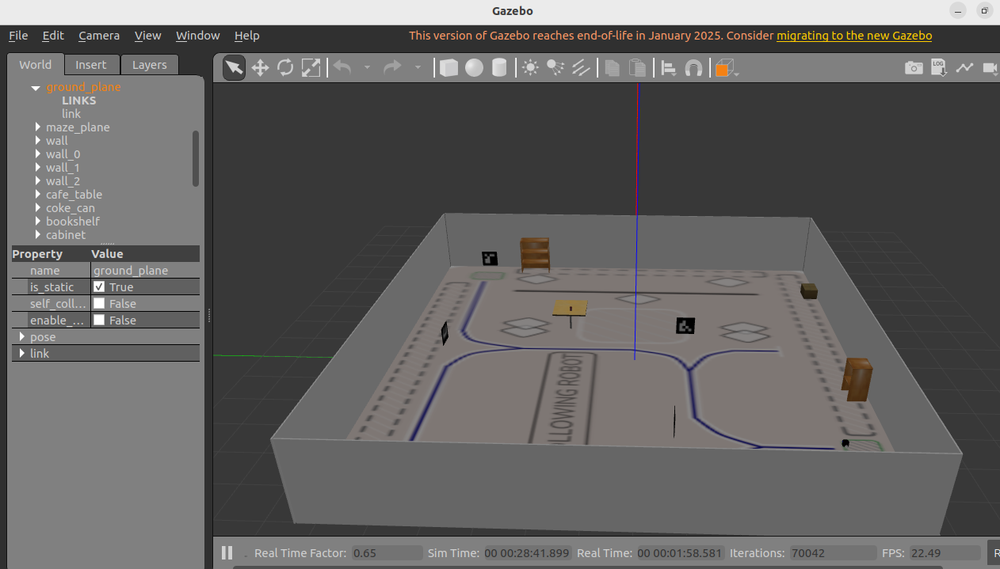
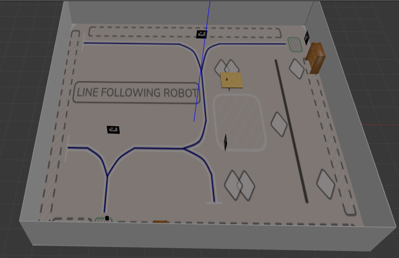

# Autonomous Line-Following & ArUco Navigation Robot


An autonomous mobile robot built for vision-based line tracking and ArUco marker navigation.

### 📑 Table of Contents
- [Demo](#-demonstration--media)
- [Complete Workflow](#-complete-project-workflow)
- [Hardware Specs](#-hardware-specifications)
- [Installation](#-installation)
- [Real Robot Launch](#-how-to-launch-real-robot---complete-guide)
- [Tuning](#-configuration--tuning)
---

## 📹 Demonstration & Media

| Gazebo World | Gazebo World |
| :---: | :---: |
|  |  |

#### Simulation Demo
(https://youtu.be/IGIriw_DM40)

#### Hardware Demo
(https://youtu.be/oh3cuF6qTDI)

---

## 🔄 Complete Project Workflow

This is the end-to-end execution flow from camera to wheels, broken into three phases that run continuously and in parallel:

### Phase 1: Perception
1. **Image Acquisition** — the camera publishes `sensor_msgs/Image` at 30 Hz on `/camera/image_raw`. In simulation, `ros_gz_bridge` bridges the image from Ignition into ROS.
2. **Pre-processing** — `cv_bridge` converts the ROS `Image` message into an OpenCV frame. The pipeline is: Grayscale → Gaussian Blur (5x5) → Adaptive Threshold → ROI crop (bottom 60% of the frame, where the line is closest to the robot).
3. **Line Extraction** — `findContours` finds candidate blobs, which are filtered by area to discard noise; the largest remaining contour is assumed to be the track. Its centroid `(cx, cy)` is computed from image moments (`M10/M00`).
4. **Error Calculation** — `error = cx - image_width/2`, normalized to the range `[-1, 1]`. This is the signal the PID controller steers on.

### Phase 2: ArUco Detection (runs in parallel with Phase 1)
Marker detection uses `cv2.aruco.detectMarkers` with the `DICT_4X4_50` dictionary. Each marker ID triggers a specific behavior:

| Marker ID | Behavior |
|---|---|
| `0` | **TURN_LEFT** — execute a 90° turn|
| `1` | **TURN_RIGHT** — execute a 90° turn |
| `2` | **STOP** waypoint — zero velocity for 3 seconds |

### Phase 3: Actuation & Feedback
- **ros2_control:** `diff_drive_controller` converts the incoming `cmd_vel` into left/right wheel velocities using the configured `wheel_separation` and `wheel_radius`.
- **Feedback loop:** wheel encoders publish to `/joint_states`, which `diff_drive_controller` uses to compute `/odom` and the `odom → base_link` TF. This is fed back into the state machine for turn-angle integration.

> This entire loop runs identically in Gazebo and on real hardware — only the sensor/actuator drivers underneath change.

---

## 🔧 Hardware Specifications

| Component | Model | Function |
|---|---|---|
| Compute | Raspberry Pi 5B + Arduino Nano 33 IoT| Runs ROS 2, vision, and control |
| Camera | Raspberry Pi camera | Line + ArUco detection |
| Motor Driver | L298N | PWM + direction to motors |
| Motors | 12V 130 RPM geared, with encoder | Differential drive |
| Battery | 3S LiPo 11.1V 3300mAh + 5V 5A buck converter | Power |

**Wiring:**
```
LEFT_PWM_PIN -> Arduino pin 11
LEFT_DIR1_PIN -> Arduino pin 7
LEFT_DIR1_PIN -> Arduino pin 8
LEFT_ENC_A -> 2
LEFT_ENC_B -> 3

RIGHT_PWM_PIN -> Arduino pin 6
RIGHT_DIR1_PIN -> Arduino pin 5
RIGHT_DIR1_PIN -> Arduino pin 4
RIGHT_ENC_A -> 9
RIGHT_ENC_B -> 10

- Arduino and Raspberrypi connected via USB
- 5V 5A power supply to Raspberrypi via buck converter connected to battery
- camera attached to Raspberrypi

```

---

## 💻 Software Prerequisites
- Ubuntu 24.04 + ROS 2 Jazzy
- `python3-opencv`, `ros-jazzy-cv-bridge`, `ros-jazzy-ros-gz-sim`, `ros-jazzy-ign-ros2-control`

---


## 🔧 Installation

```bash
mkdir -p ~/My_projects/line_following_robot/src && cd src
git clone https://github.com/geddadasuresh84326/self-driving-robot.git .
cd ..
rosdep install --from-paths src --ignore-src -r -y
colcon build --symlink-install
source install/setup.bash
```
---

## 🤖 How to Launch REAL ROBOT - 

### Step 1: Setup Raspberry Pi

```bash
# On Pi 5B - Flash Ubuntu 24.04 Server + Install ROS2 Jazzy
sudo apt update && sudo apt install ros-Jazzy-ros-base python3-pip
pip3 install opencv-python


# Clone same repo on Pi
mkdir -p ~/line_following_robot/src && cd ~/line_following_robot/src
git clone https://github.com/geddadasuresh84326/self-driving-robot.git .
cd .. && colcon build --symlink-install
```

### Step 2: Hardware Bringup & Calibration

**1. Camera Calibration:**
```bash
calibrate your camera to get the characteristics of your camera,use camera_calibrate.py file in robot_vision package
```

**2. Encoder & Odometry Calibration:**
Measure `wheel_separation` (distance between wheels) and `wheel_radius` with a ruler, then update `robot_controllers.yaml` with the measured values.

### Step 3: Launch Real Robot

The real robot launch file `real_robot.launch.py` includes: `robot_state_publisher` + `ros2_control` (real hardware) + camera + line + ArUco nodes.

```bash
# On Pi
source ~/line_following_robot/install/setup.bash

# 1. Full bringup (drivers + controllers + camera)
ros2 launch robot_bringup real_robot.launch.py use_sim_time:=false

# 2. Start Autonomous Mode
ros2 run robot_navigation line_follower

# 4. Emergency Stop
ros2 topic pub /robot_diff_drive_controller/cmd_vel geometry_msgs/msg/TwistStamped "{linear: {x: 0.0}, angular: {z: 0.0}}" -1
```

## ⚙️ Configuration & Tuning

Edit `robot_controller/config/robot_controllers.yaml`:
- `wheel_separation: 0.18` → measure on the real chassis
- `wheel_radius: 0.0335`

Edit `scripts/line_follower.py`:
- `KP=0.8`, `KD=0.2` → tune on track

---
